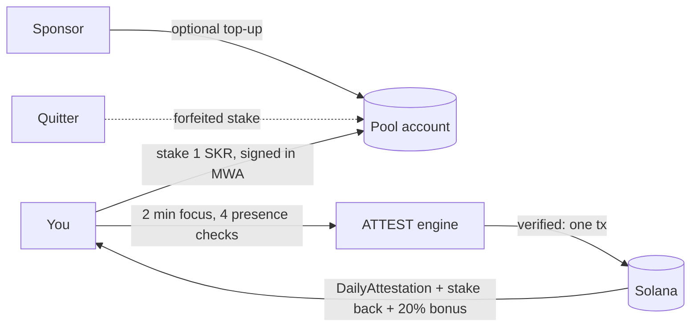

# CLOCK IN, built on PRESENCE

**Stake SKR on your focus. Prove you kept it.**

Every Seeker owner knows the loop: you pick up the phone to do one thing and lose twenty minutes. CLOCK IN is a
daily appointment with your own attention, with skin in the game:

1. **Stake** a little SKR and start a focus session (2 or 25 minutes).
2. **Put the phone down.** The screen stays on; it buzzes once per window at an unpredictable moment. Tap *I'm here*.
3. **Finish:** your stake comes back **plus a 20% bonus**, in the same Solana transaction that records your
   attestation. **Quit, switch apps or miss a check:** your stake goes to the pool that pays everyone who finished.

<p>


</p>

**Demo video:** [`demo/clock-in-demo-2x.mp4`](demo/clock-in-demo-2x.mp4) (3 min at 2× speed): a staked session that
finishes (stake back + bonus), then one that leaves the app (stake forfeited to the pool). Recorded on the emulator,
with the app and wallet driven by `scripts/device_e2e.py`.

*Screenshots: Android emulator with Solana Mobile's test wallet, local validator, **development mode** (Seeker
eligibility bypassed and labeled). Rewards are SKR-TEST, a valueless test mint with SKR's 6 decimals.*

## Why nobody has done this before

Focus apps run on a **local timer**. Anyone can fake one, so nobody can put money on them. Commitment contracts work
(in a randomized trial, smokers offered a deposit contract were 3 points more likely to quit, effects lasting a year,
[Giné, Karlan & Zinman](https://poverty-action.org/publication/put-your-money-where-your-butt)), but only when
someone can check the outcome.

**PRESENCE is that check, with no referee:**

| What a cheater would try | Why it fails |
|---|---|
| Fake the timer / fast-forward | The **server** times the session from its own clock. Checkpoints that arrive early are rejected. |
| Leave the app and come back | Every checkpoint records whether the session stayed in the foreground. One miss forfeits the stake. |
| Script the taps | Checks appear at random moments; answer times that are instant or metronome-steady are flagged `AUTOMATION_DETECTED`. |
| Replay or forge evidence | Checkpoints form a hash chain signed by a per-session Android Keystore key bound into the wallet's sign-in. |
| Farm the bonus pool with many wallets | One claim per **Seeker Genesis Token** per mission per day: a device, not a wallet. |
| Claim the payout twice | Payout and attestation are one transaction on a PDA that can be created once. |

This builds on a security idea formalized in 2026: real-time human attention is a scarce resource that can't be
parallelized, so time-bound, identity-bound challenges make sustaining *s* fake identities cost grow linearly with *s*
([Human Challenge Oracle, arXiv 2601.03923](https://arxiv.org/abs/2601.03923)). Seeker adds what that paper's
browser setting lacks: a hardware-bound identity per device.

## Why it fits CLOCK IN

- **Stickiness:** a daily appointment, streak, league and money at stake. Behavioural research suggests appointments
  beat open-ended commitments ([arXiv 2110.06876](https://arxiv.org/abs/2110.06876)), so each session is a scheduled
  clock-in rather than a vague goal.
- **Seeker-native:** the Seeker Genesis Token makes the pool Sybil-resistant per device, and Mobile Wallet Adapter
  signs the sign-in and the stake in one prompt.
- **SKR as the core mechanic, not decoration:** you stake SKR, finishers earn SKR, quitters fund the pool, and
  sponsors can top it up.

## How SKR moves



- **Stake.** ATTEST builds the transfer; the wallet signs it together with the sign-in message; ATTEST submits it
  only if it is byte-for-byte the transaction it issued.
- **Pay.** On success, `record_attestation` and a `TransferChecked` of *stake + bonus* from the pool go in **one
  transaction**. The bonus is capped by what the pool holds.
- **Forfeit.** Rejected sessions, and sessions abandoned until they expire, leave their stake in the pool.
- **Real SKR** is `SKRbvo6Gf7GondiT3BbTfuRDPqLWei4j2Qy2NPGZhW3` (classic SPL Token, 6 decimals). We can't mint it,
  which is why everything is transfer-based. Pointing `REWARD_MINT` at it is the mainnet switch.

**Devnet (live):**

| | |
|---|---|
| Program | `CFZsFPtvwo5KDenV3qgorroaRmT7NuYsfPnd4avFS2cT` |
| SKR_TEST mint (6 decimals) | `GGqPuCZvbfmVuaUDU5AHqSxrMSbM9L3qJMP1Q7p7myRU` |
| Example: 2-min session attested, 1 SKR-TEST stake + 0.2 bonus paid in one tx | [3nPy…FdA](https://explorer.solana.com/tx/3nPyCXQkQ8AFKm6pAXSJYpTpLeAHwj9J98xfZ5sKBEJ4Vmpo5q8bvSnCqyTvEXB3yna5Ua9VLXRK7FXtnUxezFdA?cluster=devnet) |

## The engine: PRESENCE

CLOCK IN is the first product on **PRESENCE**, a general engine for "prove a person actually did this process":

- **Client collects, ATTEST decides, chain anchors.** The app never sends `verified`, `reward` or `assurance`.
- **Evidence chain.** `checkpoint_i = SHA256("PRESENCE/cp/v2" | prev | "{i}|{ts}|{elapsed}|{fg}|{taps}|{response_ms}" | nonce)`,
  identical in Kotlin and Python (shared golden vectors).
- **Privacy.** Per window: a foreground flag, a tap count and one answer time. No location, sensors, contacts or
  background tracking. Only a 32-byte root goes on-chain.
- **Assurance levels.** P1 = wallet sign-in + Seeker Genesis Token, P2 = P1 + process evidence. P3 (witnesses) and
  P4 (hardware attestation) are designed, not built.
- **`verifyPresence()` SDK.** Any app can check an attestation on Solana without trusting our server
  ([docs/integration.md](docs/integration.md)).

The same engine extends to verified field work (health-worker visits, cold-chain handovers). That's the roadmap,
not this submission: those users don't carry Seekers yet, and those claims need place-binding we haven't built.

Docs: [architecture](docs/architecture.md) · [trust model](docs/trust-model.md) ·
[evidence](docs/evidence-model.md) · [security](docs/security.md) · [missions](docs/mission-policy.md) ·
[integration](docs/integration.md) · [demo script](docs/demo.md)

## Honest limitations

- **Not tested on a real Seeker.** Seeker Genesis Token verification is implemented and unit-tested; every run so far
  used development mode, which is labeled on every screen and receipt.
- **This phone, not you.** It proves *this* device stayed on the session with a person answering. It can't stop you
  using a second phone.
- **Heuristics, not proof.** Automation detection catches naive scripts; a script with human-like random delays can pass.
- **Single operator.** One attestor key and one ATTEST server. A Guardian quorum staking SKR is designed, not built
  ([trust-model.md](docs/trust-model.md)).
- **Test tokens only.** Devnet and localnet use SKR-TEST and a dev-only faucet, which the server refuses on mainnet.

## Run it

```bash
. scripts/toolchain.env
anchor build
scripts/dev_stack.sh                 # validator + program + SKR_TEST pools + ATTEST (dev mode) on :8787
./gradlew :app:installDebug          # emulator reaches the host at 10.0.2.2
```

Install Solana Mobile's `fakewallet-v1-debug.apk`
([MWA releases](https://github.com/solana-mobile/mobile-wallet-adapter/releases)) on the emulator. New test wallets
are funded by the dev faucet on connect. For devnet: `scripts/devnet_setup.sh`, then `scripts/fund_pool.sh`.

## Tests

```bash
cd backend && uv run pytest -q                 # 33 tests: protocol, replay, policy, stakes, forfeits, bonuses, pools, faucet
scripts/e2e_localnet.sh                        # real chain: deposit, stake round trip, forged stake refused, payout, SDK
anchor test --validator legacy                 # program: attestor auth, day range, claim index, streak, double settlement
./gradlew :app:testDebugUnitTest               # Kotlin evidence chain = Python golden vectors
python3 scripts/device_e2e.py <adb-serial> happy leave   # drives the real app + wallet on a device/emulator
```
