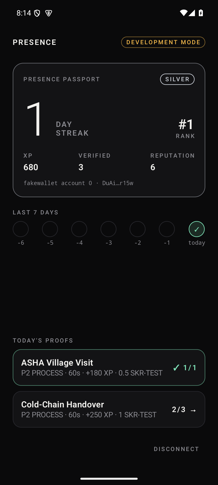
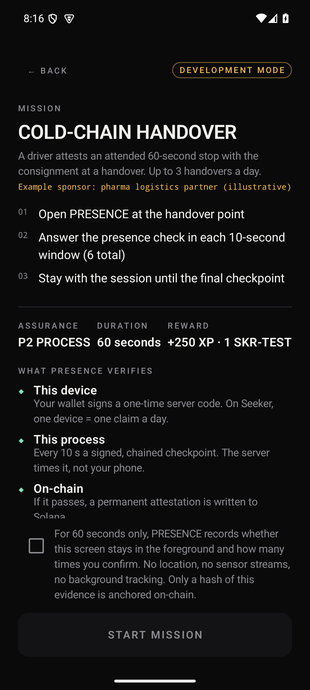
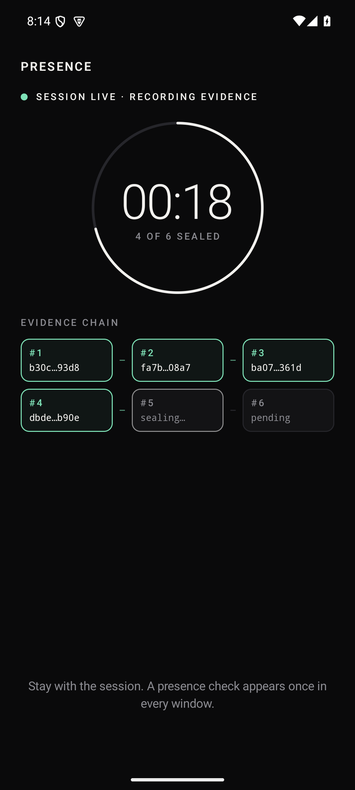
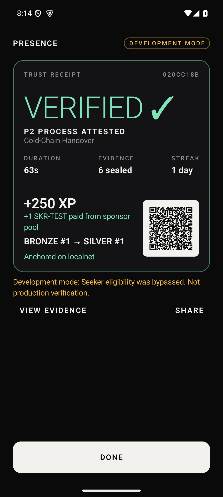
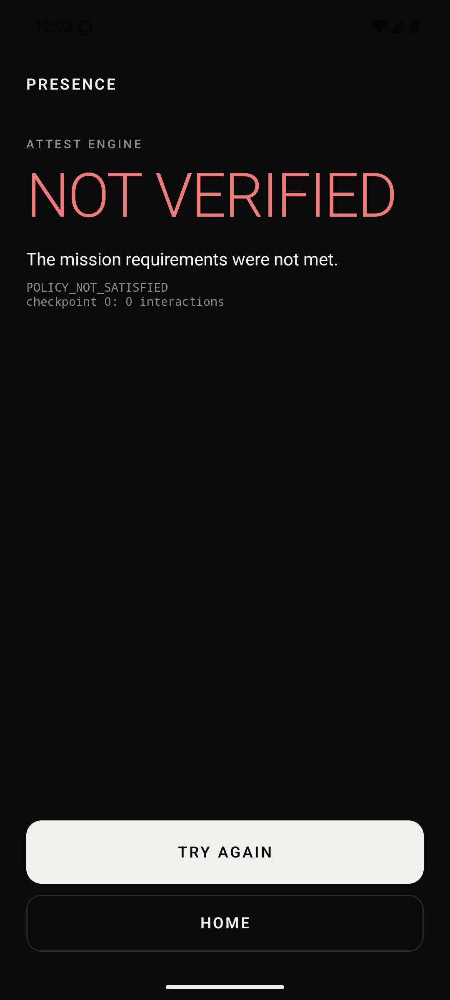
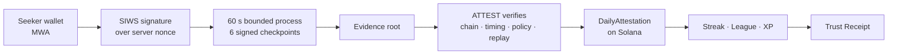
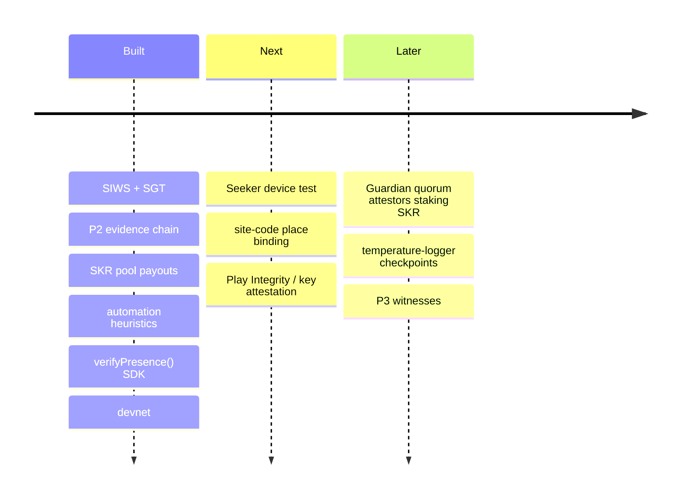

# PRESENCE

**Field proof on Seeker: sponsors pay for verified outcomes, not installs.**

One Seeker, one attended action, a server-timed evidence chain, and an on-chain attestation that pays SKR out of a
sponsor's pool in the same transaction. Two missions ship: an **ASHA village-visit check-in** and a
**cold-chain handover stop**.

> Seeker gives you trusted device identity. ATTEST verifies the process behind your actions.
> PRESENCE turns verified participation into reputation, access, and rewards.

```text
ACTION → EVIDENCE → TRUST → VALUE → REPUTATION
```

<p>





</p>

*Screenshots: Android emulator, local ATTEST and validator, **development mode** (Seeker eligibility bypassed and
labeled), rewards in SKR-TEST. The same flow runs on devnet:*

| Devnet | Address |
|---|---|
| Program | `CFZsFPtvwo5KDenV3qgorroaRmT7NuYsfPnd4avFS2cT` |
| Attestor | `BD7uCuSscR6kLH7Bn1f7y59zWUTsuHvjBVE8ePGdneRP` |
| SKR_TEST mint (6 decimals) | `GGqPuCZvbfmVuaUDU5AHqSxrMSbM9L3qJMP1Q7p7myRU` |
| Example attestation + 0.5 SKR-TEST payout | [8p44…myer](https://explorer.solana.com/tx/8p44JowS4qyR3TJhfcp4aVE1NAaawrVThD8SKxDcTifEsZyaThgEJGC9wB98cN1UDokHbTtkhWZiSGcXzdGmyer?cluster=devnet) |

---

## 1. Problem

Apps can verify that a key signed something. They cannot verify that the **intended process** happened: that a user
actually stayed and participated, that the claim isn't a replay, or that one device isn't farming the same action.
Sponsors end up paying for installs and signatures rather than outcomes.

The same gap costs real money off-chain. Field programmes pay health workers per reported visit, and logistics
partners pay per completed handover. Today those reports can't be audited: anyone can claim a visit, and nothing
shows whether someone stayed with a temperature-sensitive consignment.

## 2. Thesis

A signature proves authorization. A **bounded, server-timed, signed evidence chain**, tied to a device identity
(Seeker Genesis Token), can prove *with a stated assurance level* that a defined process took place. That is a primitive
other apps can rely on.

## 3. Solution

One meaningful mobile action, attested end-to-end:



## 4. Trust model

**The client collects evidence. ATTEST decides. The chain anchors.** The app never sends `verified`, `reward` or
`assurance`. ATTEST owns nonces, the server clock, policy evaluation, claim state and rewards, and only its attestor key
can write on-chain. See [docs/trust-model.md](docs/trust-model.md).

## 5. Assurance levels

| Level | Meaning | Status |
|---|---|---|
| **P1 VERIFIED** | Wallet signed a fresh server nonce + wallet holds a Seeker Genesis Token | ✅ implemented (SGT bypassed and labeled in dev mode) |
| **P2 PROCESS** | P1 + continuous, server-timed, ephemeral-key-signed evidence satisfying the mission policy | ✅ implemented |
| **P3 WITNESSED** | P2 + BLE co-presence witnesses under a quorum | ❌ not implemented (policies requiring it are refused) |
| **P4 HIGH ASSURANCE** | Hardware-backed device attestation | ❌ not implemented |

PRESENCE is not proof of personhood and does not claim perfect bot or Sybil resistance.

## 6. Architecture

```text
app/                 Android: Kotlin, Compose, Hilt, Mobile Wallet Adapter (from the Solana Mobile scaffold)
backend/attest/      ATTEST engine: FastAPI, SQLite, cryptography, solders
backend/missions.json  Mission policies
programs/presence/   Anchor 1.2 program: Config, PresenceProfile, DailyAttestation
tests/program/       Program tests (local validator)
scripts/             toolchain.env, dev_stack.sh, e2e_localnet.sh
docs/                architecture, trust model, evidence model, security, mission policy, integration
```

Details: [docs/architecture.md](docs/architecture.md).

## 7. Mission policy

Typed, data-defined, evaluated in exactly one function (`backend/attest/policy.py::evaluate`):

| Mission | Attests | Claims/day | Reward |
|---|---|---|---|
| `asha-village-visit` | attended 60 s check-in at a visit | 1 per device | 180 XP + 0.5 SKR |
| `cold-chain-cargo` | attended 60 s stop at a handover | 3 per device | 250 XP + 1 SKR |

Sponsors in the app are illustrative. **Neither mission proves location:** no GPS is collected. Place binding and
temperature-logger hashes are planned. `POST /missions/generate` drafts new policies from plain language (rules by
default, optional LLM), always validated by the same `build_policy` and returned for review.

See [docs/mission-policy.md](docs/mission-policy.md).

## 8. Evidence model

```text
genesis      = SHA256("PRESENCE/genesis/v1" | session_id | nonce)
checkpoint_i = SHA256("PRESENCE/cp/v1" | prev | "{i}|{ts}|{elapsed}|{fg}|{taps}" | nonce)
root         = SHA256("PRESENCE/root/v1" | last | witness_root)
```

Each checkpoint hash and the root are signed by a per-session **Android Keystore P-256 key**, whose fingerprint is
inside the SIWS message the wallet signed. Python and Kotlin implementations share golden test vectors.
See [docs/evidence-model.md](docs/evidence-model.md).

## 9. Security

Replay (single-use nonce + state machine), double settlement (claim registry + one PDA per profile per day), client
tampering (server recomputes everything, server clock), session theft (ephemeral key), device farming (one claim per
SGT per day). The limitations are stated plainly in [docs/security.md](docs/security.md).

## 10. Privacy

A checkpoint contains only a foreground flag and a tap **count** for a 10-second window: no location, sensors, raw
touches or background tracking. The app asks for explicit consent before each session. Only a 32-byte evidence root
goes on-chain.

## 11. On-chain model

| Account | Seeds | Contents |
|---|---|---|
| `Config` | `["config"]` | `admin`, `attestor` |
| `PresenceProfile` | `["profile", wallet]` | `owner`, `sgt_mint`, `level`, `reputation`, `stats{attestations, current_streak, best_streak, last_day}` |
| `DailyAttestation` | `["attestation", profile, sha256(mission), day_le, seq]` | `day`, `mission_id = sha256(id)`, `evidence_root`, `assurance_level`, `attestor`, `recorded_at` |

`record_attestation` requires the configured attestor signature and a day of today or yesterday (UTC). The attestor
pays rent, so users need no SOL.

**SKR settlement.** Rewards are **transferred** out of a sponsor-funded pool, never minted. Real SKR
(`SKRbvo6Gf7GondiT3BbTfuRDPqLWei4j2Qy2NPGZhW3`, 6 decimals) has its own mint authority.
- **Funding:** sponsors move SKR into the pool and register the transaction with `POST /sponsor/deposit`; ATTEST reads it from chain before crediting the mission.
- **Payout:** a verified run reserves its reward from that balance, and the reward `TransferChecked` rides in the **same transaction** as `record_attestation`.
- **Double-pay guard:** a claim can't be paid twice, because its PDA can be created once.
- **Devnet:** the flow uses an SKR_TEST mint, and receipts say `SKR-TEST`.

[docs/architecture.md](docs/architecture.md#skr-and-sponsor-pools)

## 12. Android architecture

`PresenceViewModel` orchestrates the session. Composables only render `UiState`. `WalletRepository` wraps MWA
(the scaffold's connect + `signMessagesDetached` flow), `EvidenceChain` and `EphemeralKey` build and sign evidence,
`AttestApi` is a typed client. The scaffold's demo code (balance, airdrop, memo transactions) was removed.

## 13. ATTEST engine

```text
CREATED ─authorize→ ACTIVE ─evidence→ SUBMITTED ─verify→ VERIFIED ─settle→ SETTLED
                                                    └──────→ REJECTED
```

Explicit failure reasons: `SESSION_EXPIRED`, `INVALID_NONCE`, `NONCE_REPLAY`, `INVALID_SIGNATURE`,
`INVALID_IDENTITY`, `SGT_NOT_ELIGIBLE`, `EVIDENCE_CHAIN_INVALID`, `POLICY_NOT_SATISFIED`, `ALREADY_CLAIMED`,
`ATTESTATION_FAILED`, `NETWORK_ERROR` (client adds `WALLET_NOT_CONNECTED`, `WALLET_NOT_FOUND`, `WALLET_REJECTED`).

## 14. Trust Receipt

Built only from the server's verification output: assurance, server-measured duration, checkpoint count, evidence
root, each check's status (`PASSED` / `DEV_BYPASS`), XP, league and rank before → after, streak, and settlement
(`CONFIRMED` + tx / `NOT_CONFIGURED` / `FAILED`), plus the test-token amount when one was minted. "View evidence" shows the root, session, checks, every checkpoint
hash and the transaction.

**Reputation is explicit counters.** `reputation` = sum of attested assurance levels (same rule on-chain and
off-chain). League = XP thresholds (BRONZE 0, SILVER 500, GOLD 1500, ELITE 5000). Rank = position among real
profiles in the ATTEST database. There are no seeded or fake users.

## 15. Developer integration

`sdk/verify-presence` gives other apps the attestation without trusting our server:

```ts
const r = await verifyPresence(connection, wallet, { mission: "asha-village-visit" });
if (r.verified && r.assuranceLevel >= 2) payWorker();
```

It's tested against a real attestation on localnet and checked against devnet. See [docs/integration.md](docs/integration.md).

## 16. Roadmap



## 17. Limitations

- **Not tested on a Seeker device.** Production SGT verification is implemented and unit-tested against
  the documented Token-2022 extension layout, but not exercised against a real SGT.
- Development mode bypasses SGT and is labeled everywhere it applies.
- Mainnet is not used; devnet rewards are SKR-TEST (no value). Mainnet needs a sponsor-funded SKR pool.
- Missions don't prove location. Automation heuristics flag naive scripts; scripts with human-like delays can pass (see docs/security.md).
- One attestor key (a file) and one ATTEST process with SQLite. The Guardian quorum is designed, not built ([trust-model.md](docs/trust-model.md)).
- The mission generator's LLM path is untested (no API key); the rules path is tested.
- P3/P4, BLE, ORE, curator network: not implemented.

## 18. Setup

Toolchains used (user-local, no system changes): JDK 17, Android SDK 35, Python ≥ 3.12 with `uv`,
Solana CLI (Agave) 4.3, Anchor 1.2.1, and an isolated rustup for `cargo build-sbf`.

```bash
. scripts/toolchain.env           # puts the toolchains above on PATH (edit paths for your machine)

# Program
anchor build

# Full local stack: validator + program + config + reward mint + ATTEST (DEVELOPMENT MODE) on :8787
scripts/dev_stack.sh

# Devnet: deploy once, then attestor key + Config + reward mint → .devnet/attest.env
solana program deploy target/deploy/presence.so --program-id target/deploy/presence-keypair.json -u devnet
scripts/devnet_setup.sh

# Android (emulator reaches the host at 10.0.2.2)
./gradlew :app:installDebug
# real device / other host:
./gradlew :app:installDebug -Ppresence.backendUrl=http://<host-ip>:8787 -Ppresence.network=devnet
```

On an emulator, install Solana Mobile's test wallet to get a real MWA flow:
`fakewallet-v1-debug.apk` from the [mobile-wallet-adapter releases](https://github.com/solana-mobile/mobile-wallet-adapter/releases).

Production configuration: [backend/.env.example](backend/.env.example).

## 19. Testing

```bash
cd backend && uv run pytest -q                       # 28 tests (1 localnet test skipped)
scripts/e2e_localnet.sh                              # real deposit + pool payout + double-pay guard + SDK on a throwaway validator
anchor test --validator legacy                       # program tests
./gradlew :app:testDebugUnitTest :app:assembleDebug  # Kotlin evidence chain vs golden vectors + APK
cd backend && uv run python -m tests.sim             # live 60 s run against a running ATTEST
cd backend && uv run python -m tests.sim --fast      # compressed run → rejected by the server clock
```

Covered: unique nonces, expiry, valid chain, tampered checkpoint, wrong root, first claim vs second claim, replayed
steps, insufficient checkpoints/duration, missing interaction/background, wrong assurance, wrong-wallet signature,
invalid wallet, stolen session without the ephemeral key, SIWS binding, SGT parsing, instruction layout, on-chain
write + on-chain double-settlement rejection, sponsor deposits (no double credit, no fakes), pool reservation,
3 claims/day with distinct claim indexes, automation detection, mission drafting and validation.

## 20. Demo

See [docs/demo.md](docs/demo.md). Automated on a USB phone or emulator:
`python3 scripts/device_e2e.py <adb-serial> happy cargo again leave`.
