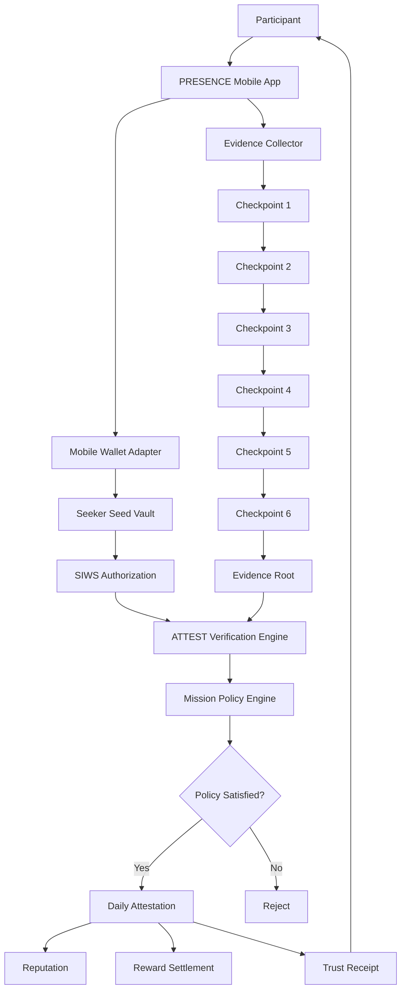
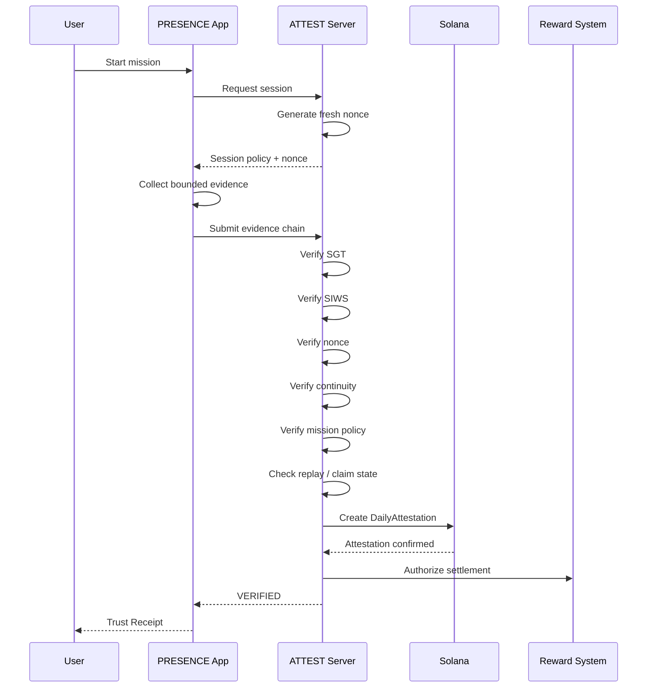
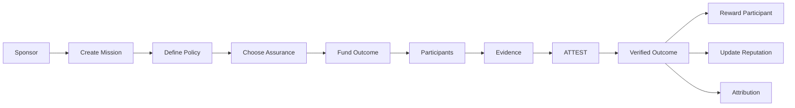
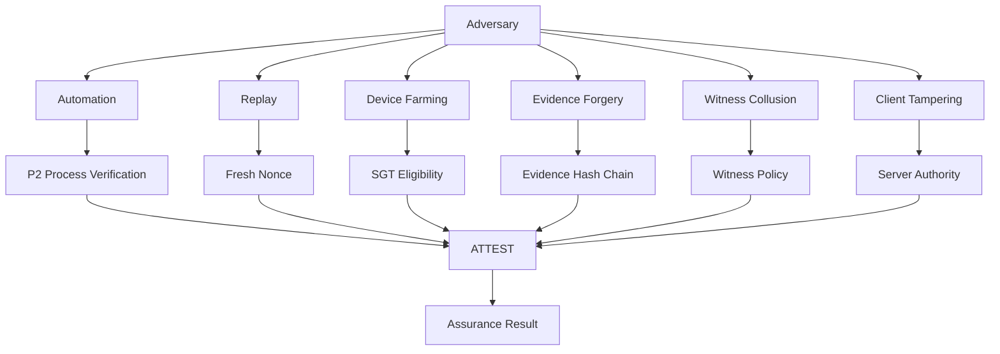
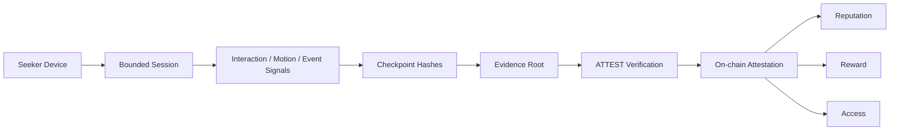
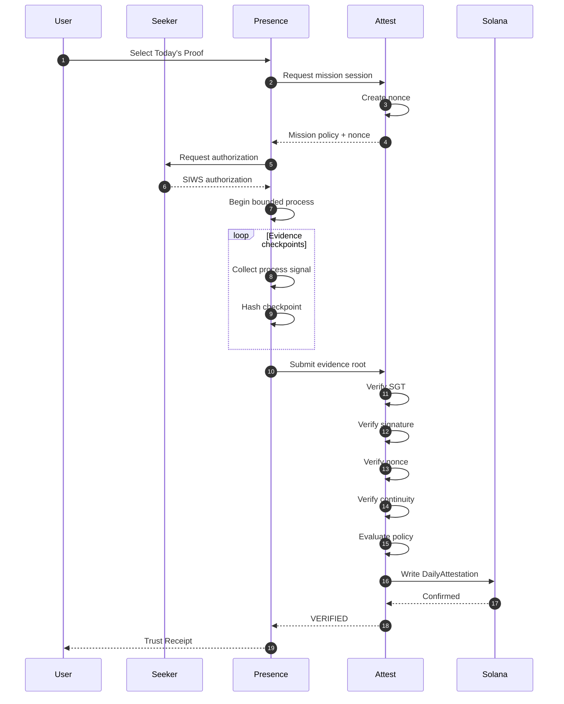
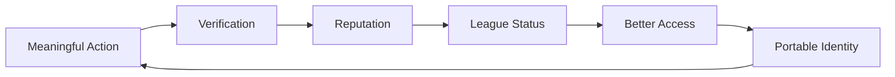
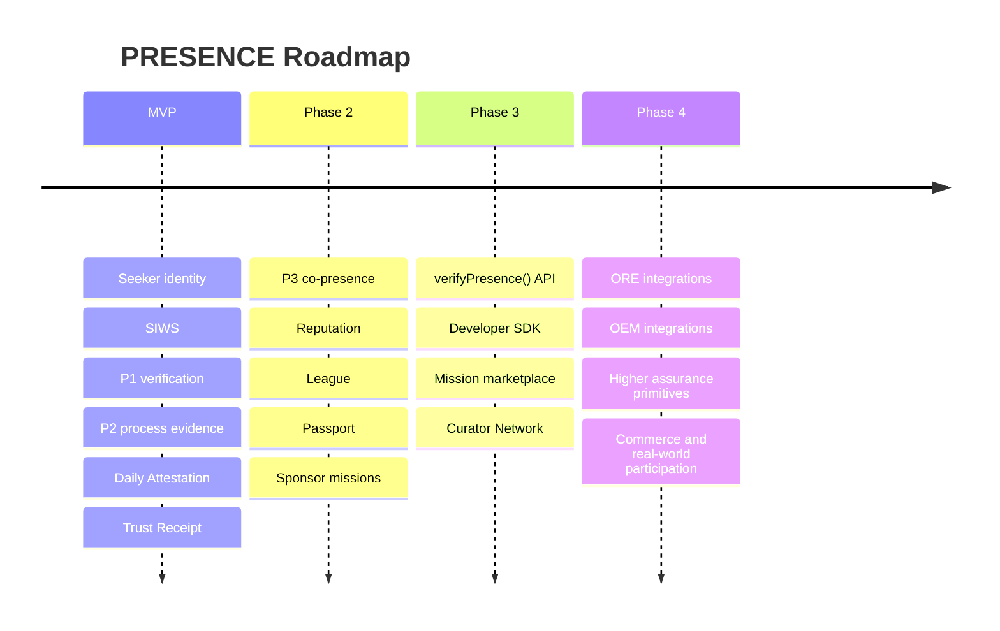

# PRESENCE

### Trusted participation infrastructure for the open mobile economy.

**Seeker gives you trusted device identity. ATTEST verifies the process behind your actions. PRESENCE turns verified participation into reputation, access, and rewards.**

> **ACTION → EVIDENCE → TRUST → VALUE → REPUTATION**

---

## Why PRESENCE Exists

Mobile ecosystems are becoming increasingly programmable.

Apps can already verify:

- wallet ownership
- signatures
- transactions
- token balances
- NFT ownership
- account activity

But there is a deeper problem:

### **A transaction does not necessarily prove that the intended action actually happened.**

A wallet signature can prove that a key authorized something.

It does not inherently prove:

- that a user completed the intended process
- that the action happened continuously
- that the interaction was not replayed
- that the same device did not farm the action repeatedly
- that a participant actually followed the required workflow
- that a high-value action deserves a higher level of assurance

This creates a trust gap between:

```text
INTENTION
   ↓
SIGNATURE
   ↓
TRANSACTION
```

and:

```text
REAL PARTICIPATION
   ↓
PROCESS
   ↓
EVIDENCE
   ↓
VERIFIABLE OUTCOME
```

PRESENCE is designed for the second layer.

---

# The Problem

## Today's mobile economy can verify activity, but not necessarily participation quality.

Consider a sponsor paying for 1,000 users to try an application.

A conventional system may measure:

```text
1,000 installs
1,000 opens
1,000 signatures
1,000 transactions
```

But the sponsor actually wants:

```text
1,000 meaningful activations
```

Those are not equivalent.

A user can:

- open an application and immediately leave
- automate repetitive actions
- replay a previous claim
- farm quests
- use multiple wallets
- satisfy superficial transaction requirements
- generate activity without meaningful participation

The result is a broken incentive loop.

### Users

Receive:

- temporary points
- disconnected quests
- short-lived rewards
- reputation that rarely travels between applications

### Applications

Receive:

- noisy activity
- difficult-to-compare engagement
- fragmented fraud systems
- duplicated verification infrastructure

### Sponsors

Pay for:

- impressions
- clicks
- installs
- transactions

when what they actually value is:

> **verified outcomes.**

---

# The PRESENCE Thesis

PRESENCE introduces a layer between **intention** and **verified participation**.

Instead of asking only:

> "Did this wallet sign?"

PRESENCE asks:

> **"What evidence was generated while this action was being performed, and does that evidence satisfy the policy required for this outcome?"**

The architecture becomes:

```text
USER INTENTION
      │
      ▼
   MISSION
      │
      ▼
  POLICY
      │
      ▼
  EVIDENCE
      │
      ▼
  ATTESTATION
      │
      ▼
 VERIFIED ACTION
      │
      ├──────────────► REWARD
      │
      ├──────────────► REPUTATION
      │
      └──────────────► ACCESS
```

PRESENCE does **not** attempt to prove biological personhood.

It creates **policy-defined assurance around participation**.

---

# What PRESENCE Is

PRESENCE is a trusted participation layer for mobile applications.

It combines:

- Seeker identity
- wallet authorization
- bounded session integrity
- process evidence
- optional co-presence
- programmable mission policies
- on-chain attestations
- portable reputation

into a single verification flow.

---

# What PRESENCE Is Not

PRESENCE is intentionally **not**:

- a generic quest board
- a points farming application
- a proof-of-human oracle
- a claim of perfect bot detection
- a biological personhood system
- a surveillance network
- a location-selling marketplace
- a replacement for Solana Mobile Activity Tracking
- a rebuilt Seeker operating system

The system makes a narrower and more defensible claim:

> **PRESENCE verifies whether a bounded participation process satisfied a predefined assurance policy.**

---

# Core Architecture



---

# The Trust Stack

PRESENCE uses progressive assurance.

Not every action requires the same amount of trust.

A low-value action may only need verified Seeker eligibility.

A high-value physical event may require corroborated participation.

Therefore:

> **Higher value → higher assurance.**

---

## P1 — VERIFIED

Establishes:

- Seeker eligibility
- SGT relationship
- wallet authorization
- claim eligibility

Conceptually:

```text
Seeker Device
      │
      ▼
SGT
      │
      ▼
SIWS
      │
      ▼
VERIFIED PARTICIPANT
```

P1 answers:

> **"Is this an eligible Seeker participant?"**

---

# P2 — CONTINUOUS

P2 adds bounded process evidence.

A mission generates a sequence of evidence checkpoints.

```text
START
  │
  ▼
C1 ──► C2 ──► C3 ──► C4 ──► C5 ──► C6
                                      │
                                      ▼
                               EVIDENCE ROOT
```

The system can establish that the required process produced a continuous evidence chain within the defined session.

P2 answers:

> **"Did this participant complete the required process under the mission policy?"**

P2 is the primary PRESENCE demonstration layer.

---

# P3 — WITNESSED

P3 adds optional multi-party corroboration.

Example:

```text
Participant A
      │
      │ challenge
      ▼
Participant B

      +

Participant C

      │
      ▼
Witness Quorum
```

A mission may require:

```text
2-of-3 independent witnesses
60-second bounded session
fresh challenge
```

P3 does **not** claim absolute location truth or biological presence.

It means:

> **The configured co-presence policy was satisfied.**

---

# P4 — HIGH ASSURANCE

P4 is reserved for higher-value or higher-risk workflows.

Potential sources include:

- stronger hardware-backed signals
- stronger device attestation
- trusted ecosystem infrastructure
- additional policy requirements

P4 is a future assurance layer.

PRESENCE does not claim that every P4 primitive is implemented today.

---

# Assurance as a Service

The important abstraction is not "one proof fits everything."

It is:

```text
MISSION VALUE
     │
     ▼
REQUIRED ASSURANCE
     │
     ├── P1
     ├── P2
     ├── P3
     └── P4
```

A sponsor chooses how much assurance its outcome requires.

For example:

| Mission | Assurance |
|---|---|
| Explore an app | P1 |
| Complete onboarding | P2 |
| Complete a meaningful workflow | P2 |
| Attend an event | P3 |
| High-value physical claim | P3/P4 |
| High-risk financial action | P4 |

This makes trust programmable.

---

# Mission Policy

Every PRESENCE mission is governed by a policy.

A policy describes:

```text
WHAT
HOW
HOW LONG
WHAT EVIDENCE
WHAT ASSURANCE
WHAT REWARD
WHAT FRAUD RULES
```

Example:

```yaml
mission:
  name: "Try Jupiter Mobile"

action:
  - open_app
  - complete_onboarding
  - execute_swap
  - remain_active

duration:
  minimum: 45s

assurance:
  required: P2

evidence:
  checkpoints: 6
  continuity: required

witness:
  required: false

reward:
  token: SKR
  amount: 0.1

anti_replay:
  nonce: single_use

eligibility:
  sgt_mint_per_day: 1
```

The client does not decide whether this policy passed.

---

# Server-Authoritative Verification

One of the most important architectural decisions:

> **The client never decides reward entitlement.**

The mobile application is an evidence collector.

The server owns:

- session nonce
- mission policy
- identity verification
- claim state
- replay prevention
- evidence validation
- attestation result
- reward authorization



---

# Why Evidence Is Structured as a Chain

PRESENCE does not upload raw sensor streams to the blockchain.

Instead, the session produces bounded evidence.

Conceptually:

```text
checkpoint_1
     │
     ▼
checkpoint_2
     │
     ▼
checkpoint_3
     │
     ▼
checkpoint_4
     │
     ▼
checkpoint_5
     │
     ▼
checkpoint_6
     │
     ▼
final_evidence_root
```

The resulting root becomes the compact cryptographic commitment to the session.

This allows the system to keep the blockchain layer small while preserving verifiability.

---

# Privacy by Design

PRESENCE is designed around **evidence minimization**.

The goal is not:

> "Collect everything about the user."

The goal is:

> **"Collect only what is required to satisfy the mission policy."**

Therefore:

- raw touch data is not placed on-chain
- raw motion streams are not placed on-chain
- raw behavioral data is not placed on-chain
- session scope is bounded
- evidence is hashed
- only required commitments are anchored
- users explicitly authorize sessions

Behavioral and motion signals, where used, are treated as **fraud signals**, not proof of biological identity.

---

# On-Chain Architecture

PRESENCE deliberately keeps the on-chain state minimal.

## `PresenceProfile`

Stores the participant's persistent trust identity.

Conceptually:

```rust
struct PresenceProfile {
    owner: Pubkey,
    sgt_mint: Pubkey,
    level: u8,
    reputation: u64,
    stats: ProfileStats,
}
```

---

## `DailyAttestation`

Stores the result of a verified mission session.

Conceptually:

```rust
struct DailyAttestation {
    profile: Pubkey,
    date: i64,
    mission_id: Pubkey,
    evidence_root: [u8; 32],
    assurance_level: u8,
}
```

---

# Why Only Two Core PDAs?

PRESENCE intentionally avoids putting the entire application state on-chain.

The blockchain should anchor:

```text
IDENTITY
ATTESTATION
REPUTATION
```

while high-volume operational computation remains off-chain.

This keeps the system:

- cheaper
- faster
- easier to iterate
- privacy-conscious
- easier to integrate

The chain becomes the **trust anchor**, not the entire backend.

---

# Evidence Session

A session conceptually contains:

```text
session_nonce
sgt_mint
start_time

checkpoint_1_hash
checkpoint_2_hash
checkpoint_3_hash
checkpoint_4_hash
checkpoint_5_hash
checkpoint_6_hash

witness_root
final_evidence_root
```

The final evidence root is what ultimately matters for the on-chain attestation.

---

# The Core User Workflow

PRESENCE intentionally makes the technology invisible to the participant.

The experience should feel like:

```text
TODAY'S PROOF
       │
       ▼
   ATTEST NOW
       │
       ▼
  Complete Action
       │
       ▼
   VERIFIED ✓
       │
       ▼
 Reputation ↑
       │
       ▼
 League ↑
```

Not:

```text
Configure nonce
Generate key
Collect sensor
Submit hashes
Wait for RPC
Inspect PDA
```

The protocol complexity belongs underneath the experience.

---

# Today's Proof

The consumer product has three primary surfaces.

## 1. TODAY'S PROOF

One meaningful verified action per day.

Example:

```text
27 DAY STREAK

GOLD #117
INDIA

4 MINUTES
P2 PROCESS

+180 XP

[ ATTEST NOW ]
```

The user should perceive:

- time
- progress
- status
- reputation
- achievement

The cryptography remains mostly invisible.

---

# 2. LEAGUE

PRESENCE uses persistent social status.

Example:

```text
BRONZE
   ↓
SILVER
   ↓
GOLD
   ↓
ELITE
```

Weekly promotion and relegation create:

- status
- belonging
- competition
- loss aversion
- recurring participation

The objective is not to make users chase meaningless points.

The objective is to make **trusted participation itself valuable**.

---

# 3. PASSPORT

The Passport is the user's portable participation identity.

Example:

```text
alice.skr

VERIFIED SEEKER

138 DAY STREAK

GOLD

2,184
VERIFIED PROCESSES

P1   1,920
P2     241
P3      23
P4       0
```

The Passport should expose real verified history rather than invented confidence scores.

It becomes a portable trust record.

---

# Trust Receipt

The Trust Receipt is the climax of the PRESENCE experience.

Example:

```text
┌─────────────────────────────────┐
│                                 │
│          VERIFIED ✓             │
│                                 │
│       P2 PROCESS ATTESTED       │
│                                 │
│       58 seconds                │
│       6 checkpoints             │
│                                 │
│       +180 XP                   │
│                                 │
│       GOLD #117 → #103          │
│                                 │
│       View Evidence →           │
│                                 │
└─────────────────────────────────┘
```

A receipt can expose:

- Seeker verification
- wallet authorization
- session timestamps
- evidence checkpoints
- assurance level
- witness policy
- replay status
- settlement transaction

The reward is not the climax.

### **Verification is the climax.**

---

# Verified Actions Marketplace

PRESENCE extends beyond the consumer application.

The long-term marketplace thesis is:

> **Don't sell attention. Sell verified outcomes.**

Instead of:

```text
Sponsor
   ↓
Advertisement
   ↓
Impression
```

PRESENCE enables:

```text
Sponsor
   ↓
Mission Policy
   ↓
Verified Participation
   ↓
Attestation
   ↓
Outcome
   ↓
Payment
```

---

# Sponsor Workflow



Sponsors can eventually measure:

```text
Required actions
Completed actions
P1 actions
P2 actions
P3 actions

Rejected
Duplicate
Average completion time

Cost / verified action
```

The business metric becomes:

### **Cost per verified action**

rather than cost per impression.

---

# Initial Beachhead

PRESENCE should not begin by trying to sell to global brands.

The first ecosystem is:

### **Seeker-native applications.**

Potential participants include:

- Solana applications
- wallets
- games
- protocols
- communities
- events

Example:

> "We need 1,000 verified activations for our mobile application."

Instead of building another custom anti-fraud system, the application can eventually define:

```text
required_assurance = P2
```

and integrate PRESENCE.

---

# Developer Integration

The long-term interface is intentionally simple.

Conceptually:

```typescript
const result = await presence.verifyAction({
  user,
  assurance: "P2",
  mission: "jupiter-mobile-onboarding"
});

if (result.verified) {
  unlockReward();
}
```

Or:

```typescript
verifyPresence(user, {
  seeker: true,
  assurance: "P2",
  reputation: 500,
  lastAttestationWithin: "7d"
});
```

Result:

```json
{
  "verified": true,
  "assurance": "P2",
  "proof": "attestation-reference",
  "reputation": 812
}
```

This API is where PRESENCE can evolve from an application into infrastructure.

---

# Integration Model

```mermaid
flowchart TD

    D1[Solana dApp]
    D2[Game]
    D3[Wallet]
    D4[Merchant]
    D5[DAO]
    D6[Event]

    D1 --> API[PRESENCE verifyPresence()]
    D2 --> API
    D3 --> API
    D4 --> API
    D5 --> API
    D6 --> API

    API --> ATTEST[ATTEST Engine]

    ATTEST --> PROFILE[Presence Profile]
    ATTEST --> ATT[Attestation]
    ATTEST --> REP[Reputation]

    ATTEST --> RESULT[PASS / FAIL + Proof]

    RESULT --> D1
    RESULT --> D2
    RESULT --> D3
    RESULT --> D4
    RESULT --> D5
    RESULT --> D6
```

---

# Why Seeker?

PRESENCE is designed around capabilities that make Seeker particularly valuable as the first platform.

### Seeker provides the identity foundation.

PRESENCE builds the participation layer above it.

The stack becomes:

```text
SEEKER
│
├── SGT
│
├── Seed Vault
│
├── Seeker ID
│
├── Solana
│
├── Mobile Stack
│
└── dApp ecosystem
        │
        ▼
    PRESENCE
        │
        ├── Process Evidence
        ├── Attestation
        ├── Reputation
        ├── Rewards
        └── Access
```

PRESENCE is therefore not trying to recreate Seeker's identity infrastructure.

It consumes it.

---

# Relationship With Activity Tracking

PRESENCE complements activity tracking rather than replacing it.

Activity tracking answers:

> **"What did I do?"**

PRESENCE answers:

> **"What should I do today, and can this action be verified under a defined assurance policy?"**

This distinction is fundamental.

```text
ACTIVITY TRACKING
        │
        ▼
   HISTORY

PRESENCE
        │
        ├── INTENTION
        ├── PROCESS
        ├── ASSURANCE
        └── VERIFIED OUTCOME
```

---

# Security Model

PRESENCE does not claim perfect fraud prevention.

Instead, it creates progressively stronger economic and technical barriers.

## Threats

### Sensor forgery

A malicious client may attempt to fabricate signals.

### Replay

A previously valid session may be reused.

### Device farming

An attacker may operate multiple eligible devices.

### Client tampering

The application may be modified.

### Session theft

An attacker may attempt to reuse session credentials.

### Witness collusion

Multiple participants may coordinate to satisfy a witness policy dishonestly.

### Privacy correlation

Persistent activity may create unwanted identity correlation.

### Double settlement

A valid mission may be claimed more than once.

---

# Mitigations

| Threat | Mitigation |
|---|---|
| Replay | Fresh single-use session nonce |
| Double claim | Server-side claim registry |
| Device farming | SGT-based eligibility |
| Client manipulation | Server-authoritative verification |
| Session theft | Ephemeral evidence key |
| Fake continuity | Evidence chain + policy verification |
| Witness abuse | Fresh challenge + quorum policy |
| Data exposure | Minimal evidence + hashes |
| Reward manipulation | Client never determines entitlement |

No mitigation is represented as absolute.

The system is designed around **assurance**, not impossible security claims.

---

# Threat Model



---

# Data Flow



Raw evidence does not need to become permanent blockchain state.

The blockchain anchors the **result and commitment**.

---

# End-to-End Protocol Flow



---

# Repository Architecture

A production implementation can be organized around clear trust boundaries.

```text
presence/
│
├── apps/
│   │
│   ├── android/
│   │   ├── ui/
│   │   ├── seeker/
│   │   ├── wallet/
│   │   ├── evidence/
│   │   └── session/
│   │
│   └── web/
│       ├── passport/
│       ├── league/
│       └── sponsor/
│
├── programs/
│   └── presence/
│       ├── programs/
│       ├── accounts/
│       ├── instructions/
│       └── errors/
│
├── services/
│   │
│   └── attest/
│       ├── sessions/
│       ├── verification/
│       ├── policy/
│       ├── replay/
│       ├── reputation/
│       └── settlement/
│
├── sdk/
│   └── verify-presence/
│
├── docs/
│   ├── architecture/
│   ├── security/
│   ├── protocol/
│   └── integrations/
│
└── README.md
```

---

# Core Components

## Android Client

Responsibilities:

- Seeker interaction
- wallet authorization
- mission UI
- bounded evidence collection
- checkpoint generation
- evidence submission
- Trust Receipt presentation

The client is **not trusted to decide outcomes**.

---

## ATTEST Engine

Responsibilities:

- session creation
- nonce generation
- identity validation
- evidence verification
- policy evaluation
- replay protection
- claim state
- assurance classification

ATTEST is the trust engine underneath PRESENCE.

---

## Solana Program

Responsibilities:

- persistent participant profile
- attestation anchoring
- assurance level
- reputation state
- verifiable references

The chain provides an independently inspectable trust anchor.

---

## Reputation Layer

Reputation is built from verified history.

Conceptually:

```text
VERIFIED ACTION
      │
      ▼
ASSURANCE
      │
      ▼
HISTORY
      │
      ▼
REPUTATION
      │
      ├──► ACCESS
      ├──► STATUS
      ├──► BETTER MISSIONS
      └──► TRUST
```

Rewards are temporary.

Reputation compounds.

That is the long-term user value.

---

# Reward Philosophy

PRESENCE is not designed around:

> "Do meaningless tasks → receive tokens."

Instead:

```text
MEANINGFUL ACTION
        ↓
VERIFIED PARTICIPATION
        ↓
REPUTATION
        ↓
ACCESS / STATUS / REWARD
```

Rewards are one output of participation.

They are not the entire product.

---

# Why Users Return

The retention loop is:



Users return because their previous participation continues to matter.

Not simply because yesterday's reward was large.

---

# Network Effects

PRESENCE becomes more useful as more applications recognize its attestations.

```text
More Users
    ↓
More Verified Participation
    ↓
Better Reputation Graph
    ↓
More Valuable Integrations
    ↓
More Sponsors
    ↓
More Missions
    ↓
More Reasons to Participate
    ↓
More Users
```

The long-term moat is therefore not the mobile UI.

It is the **portable trust graph generated by verified actions**.

---

# Business Model

The initial business model is based on verified outcomes.

Sponsors define:

```text
Desired Action
      +
Required Assurance
      +
Reward
      +
Budget
```

PRESENCE provides:

```text
Verified Participants
+
Verification Infrastructure
+
Attribution
+
Reputation
```

The intended economic unit becomes:

### **Cost per verified action**

rather than:

### Cost per impression.

A future platform fee can be applied to verified outcome volume.

Any fee percentage should be treated as a business hypothesis until validated with real customers.

---

# Ecosystem Expansion

## Phase 1 — Seeker Ecosystem

Focus:

- Solana mobile apps
- wallets
- games
- protocols
- Seeker-native communities

Goal:

> Establish PRESENCE as a trusted participation primitive.

---

## Phase 2 — Open Ecosystem

Expand into:

- protocols
- creators
- communities
- events
- DAOs

---

## Phase 3 — Real-World Commerce

Potential applications:

- merchant participation
- loyalty
- physical events
- product experiences
- verified purchases
- local campaigns

The same policy abstraction remains:

```text
ACTION
→ EVIDENCE
→ ASSURANCE
→ ATTESTATION
→ VALUE
```

---

# Optional Ecosystem Integrations

## SKR

PRESENCE can introduce a future **Curator Network**.

Curators can stake behind attestation policies.

Example:

```text
24,120 SKR
      │
      ▼
P3 POLICY
      │
      ▼
VERIFIED CO-PRESENCE
```

The purpose is to create economic alignment around trusted policy infrastructure.

This is intentionally different from the role of Solana Mobile Guardians.

---

# ORE

ORE is an optional extension rather than the core PRESENCE narrative.

Potential future missions can use ORE primitives such as:

```text
Deploy
Automate
Checkpoint
ClaimORE
```

The core product remains independent of ORE.

---

# TEEPIN

PRESENCE is architecturally aligned with the idea of hardware-backed trust and trusted physical infrastructure.

However:

> **TEEPIN integration should only be claimed when the relevant primitive is actually implemented.**

The architecture is designed to become OEM-ready rather than Seeker-exclusive.

---

# Why This Is Different

Most systems optimize for one of these:

```text
IDENTITY
REWARDS
QUESTS
ANALYTICS
ADVERTISING
ANTI-FRAUD
```

PRESENCE connects them around a single primitive:

### **Verified participation.**

The key abstraction is:

```text
                    PRESENCE

       ┌────────────────────────────┐
       │       Mission Policy       │
       └──────────────┬─────────────┘
                      ↓
       ┌────────────────────────────┐
       │       Process Evidence     │
       └──────────────┬─────────────┘
                      ↓
       ┌────────────────────────────┐
       │        ATTEST Engine       │
       └──────────────┬─────────────┘
                      ↓
       ┌────────────────────────────┐
       │      Verified Action       │
       └───────┬────────┬───────────┘
               ↓        ↓
          Reputation   Reward
               ↓
             Access
```

This turns PRESENCE from a "daily reward app" into a potential **trust infrastructure layer**.

---

# Design Principles

## 1. Evidence over claims

Do not claim more than the evidence supports.

---

## 2. Assurance over absolutes

Never promise:

- 100% anti-bot
- perfect Sybil resistance
- biological personhood

Instead provide measurable assurance levels.

---

## 3. Server decides

The client collects evidence.

The verification layer decides.

---

## 4. Minimal on-chain state

Put commitments and durable trust state on-chain.

Keep high-volume computation off-chain.

---

## 5. Privacy by minimization

Collect what is required.

Store what is necessary.

Expose what the user understands.

---

## 6. Reputation compounds

A reward can disappear.

Verified history can continue creating value.

---

## 7. Higher value requires higher assurance

Not every action deserves the same security cost.

---

## 8. Technology should disappear into the UX

The user should see:

```text
ATTEST NOW
     ↓
VERIFIED ✓
```

not a cryptography tutorial.

---

# MVP Scope

The first production-quality vertical slice is intentionally narrow.

### P0 — Required

- Seeker integration
- MWA
- SIWS
- server-side SGT verification
- fresh daily nonce
- ephemeral evidence key
- one bounded natural process
- six evidence checkpoints
- evidence hash chain
- one mission
- DailyAttestation
- reward settlement
- streak
- league
- Trust Receipt

### P1 — Enhancement

- real second-Seeker BLE demonstration
- P3 witness workflow

### P2 — Expansion

- ORE integration
- Curator Network
- sponsor marketplace
- developer API
- advanced mission policies

---

# What We Deliberately Don't Build First

To preserve product focus, the MVP does **not** attempt to build:

- a full advertising network
- a generic quest marketplace
- a global merchant network
- a complete social network
- an AI employee
- a universal proof-of-personhood system
- a permanent sensor surveillance system
- a complex multi-token economy

The first objective is simple:

> **Make one meaningful mobile action verifiably attestable.**

---

# Demo Scenario

The ideal demonstration takes approximately one minute.

```text
00s
Open PRESENCE

05s
Authenticate with Seeker

10s
Mission begins

15s
Evidence collection starts

15–45s
Natural interaction

45s
Final checkpoint

50s
ATTEST verifies session

55s
On-chain attestation confirmed

60s
VERIFIED ✓

      +180 XP
      GOLD #117 → #103
```

The audience should understand the product without needing the architecture explained first.

Then the architecture explains **why the result can be trusted**.

---

# The Product in One Sentence

> **PRESENCE turns Seeker's trusted device identity into a programmable layer for verified mobile actions, reputation, access, and rewards.**

---

# The Consumer Promise

> **Complete one meaningful action. PRESENCE verifies the process, records your reputation, and rewards you for trusted participation.**

---

# The Developer Promise

> **Define the action. Choose the assurance. Let PRESENCE verify the participation.**

---

# The Sponsor Promise

> **Don't pay for attention. Pay for verified outcomes.**

---

# The Protocol Promise

> **Make participation portable.**

---

# Roadmap



---

# Future: `verifyPresence()`

The ultimate abstraction is not the PRESENCE application.

It is a standard way for applications to ask:

```text
"Can I trust that this action happened
with the assurance level I require?"
```

For example:

```typescript
const verification = await verifyPresence(user, {
  seeker: true,
  assurance: "P2",
  reputation: {
    minimum: 500
  },
  recency: {
    maximumAge: "7d"
  }
});
```

The application receives:

```text
PASS
```

or:

```text
FAIL
```

with a verifiable proof reference.

This enables:

```text
Game
 └── P2 required for ranked mode

Merchant
 └── P3 required for physical reward

DAO
 └── 30-day verified participation required

Protocol
 └── P2 required for campaign allocation
```

The same trust layer can power all of them.

---

# The Bigger Vision

Today:

```text
I completed a mission.
```

Tomorrow:

```text
I have a history of verified participation.
```

Eventually:

```text
Applications can trust my participation
without rebuilding their own verification stack.
```

That is the transition:

```text
Activity
   ↓
Verified Activity
   ↓
Portable Reputation
   ↓
Programmable Trust
   ↓
Open Mobile Economy
```

---

# Status

> **Hackathon / MVP Build**

Core architecture defined.

Initial implementation target:

**P1 + P2 + one mission + DailyAttestation + Trust Receipt**

Future layers are intentionally separated from the core verification path.

---

# Philosophy

PRESENCE is built around a simple observation:

> **The next generation of mobile applications will not only need to know who you are. They will need to know what you actually did.**

Identity is the beginning of trust.

Transactions are evidence of authorization.

But meaningful participation requires something more:

### **A verifiable process.**

PRESENCE is that layer.

---

## PRESENCE

**ACTION → EVIDENCE → TRUST → VALUE → REPUTATION**

**Built for Seeker. Designed for an open mobile economy.**