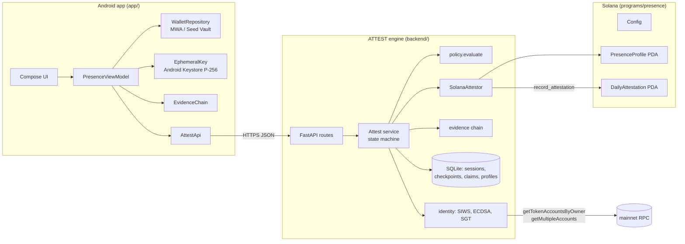

# Architecture

PRESENCE is three components with one trust boundary: **the client collects evidence, ATTEST decides, the chain anchors.**

## Repository layout

| Path | What it is |
|---|---|
| `app/` | Android app (Kotlin, Jetpack Compose, Hilt, MWA clientlib-ktx 2.0) |
| `backend/attest/` | ATTEST engine (Python 3.12+, FastAPI, SQLite, `cryptography`, `solders`) |
| `backend/missions.json` | Mission policies (data, not code) |
| `backend/tests/` | Critical-path tests + `sim.py` reference client |
| `programs/presence/` | Anchor 1.2 program: `initialize_config`, `record_attestation` |
| `tests/program/` | Program tests (anchor-client against a local validator) |
| `scripts/` | `toolchain.env`, `dev_stack.sh`, `e2e_localnet.sh` |

## Android modules (`app/src/main/java/com/presence`)

| Package | Responsibility |
|---|---|
| `wallet/` | MWA connect + detached message signing; persists address/label/auth token only |
| `evidence/` | `EvidenceChain` (hash chain, mirrors `evidence.py`), `EphemeralKey` (Keystore P-256) |
| `attest/` | Typed HTTP client + DTOs; maps server failures to `AttestException(reason)` |
| `session/` | `PresenceViewModel` orchestrates the mission; `PresenceState` holds UI state + reason copy |
| `ui/` | Theme and five screens. No business logic in composables. |

## ATTEST modules (`backend/attest`)

| Module | Responsibility |
|---|---|
| `service.py` | The state machine; the only place PASS/FAIL, claims and rewards are decided |
| `policy.py` | Typed `MissionPolicy`, the single `evaluate()` |
| `evidence.py` | Chain/root definitions |
| `identity.py` | SIWS message, ed25519 wallet check, P-256 ephemeral check, SGT verifiers |
| `reputation.py` | Streak, league, explicit counters |
| `settlement.py` | `record_attestation` instruction builder + `SolanaAttestor` |
| `store.py` | SQLite schema (durable nonce/claim state) |
| `errors.py` | Every failure reason |
| `app.py` | HTTP routes only |

## Status

- **Implemented:** everything above; P1 + P2 assurance; localnet settlement.
- **Planned:** devnet deployment of the program; developer SDK (`sdk/` does not exist yet); P3 witness flow.
- **Experimental:** none shipped.
