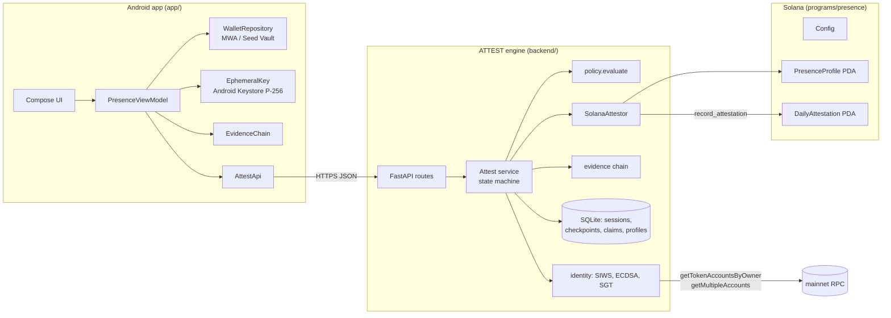
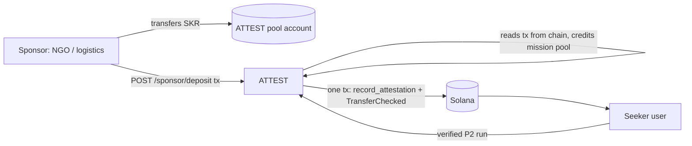

# Architecture

PRESENCE is three components with one trust boundary: **the client collects evidence, ATTEST decides, the chain anchors.**

## Repository layout

| Path | What it is |
|---|---|
| `app/` | Android app (Kotlin, Jetpack Compose, Hilt, MWA clientlib-ktx 2.0) |
| `backend/attest/` | ATTEST engine (Python 3.12+, FastAPI, SQLite, `cryptography`, `solders`) |
| `backend/missions.json` | Mission policies (data, not code) |
| `backend/tests/` | Critical-path tests + `sim.py` reference client |
| `programs/presence/` | Anchor 1.2 program: `initialize_config`, `record_attestation` |
| `tests/program/` | Program tests (anchor-client against a local validator) |
| `sdk/verify-presence/` | `verifyPresence()`: TypeScript reader/verifier for on-chain attestations |
| `scripts/` | `toolchain.env`, `dev_stack.sh`, `e2e_localnet.sh`, `devnet_setup.sh`, `fund_pool.sh`, `device_e2e.py` |

## Android modules (`app/src/main/java/com/presence`)

| Package | Responsibility |
|---|---|
| `wallet/` | MWA connect + detached message signing; persists address/label/auth token only |
| `evidence/` | `EvidenceChain` (hash chain, mirrors `evidence.py`), `EphemeralKey` (Keystore P-256) |
| `attest/` | Typed HTTP client + DTOs; maps server failures to `AttestException(reason)` |
| `session/` | `PresenceViewModel` orchestrates the mission; `PresenceState` holds UI state + reason copy |
| `ui/` | Theme and five screens. No business logic in composables. |

## ATTEST modules (`backend/attest`)

| Module | Responsibility |
|---|---|
| `service.py` | The state machine; the only place PASS/FAIL, claims and rewards are decided |
| `policy.py` | Typed `MissionPolicy`, the single `evaluate()` |
| `evidence.py` | Chain/root definitions |
| `identity.py` | SIWS message, ed25519 wallet check, P-256 ephemeral check, SGT verifiers |
| `reputation.py` | Streak, league, explicit counters |
| `anomaly.py` | Automation heuristics over presence-check answer times (statistics, not ML) |
| `mission_generator.py` | Plain-language → draft mission policy (rules by default, optional LLM), validated by `build_policy` |
| `settlement.py` | `record_attestation` + pool `TransferChecked` in one transaction; on-chain deposit verification |
| `store.py` | SQLite schema (durable nonce/claim state) |
| `errors.py` | Every failure reason |
| `app.py` | HTTP routes only |

## SKR and sponsor pools

- **Outcomes, not installs.** Sponsors pay per verified, attested action. The unit is "cost per verified action".
- **Transfer, not mint.** SKR (`SKRbvo6Gf7GondiT3BbTfuRDPqLWei4j2Qy2NPGZhW3`, classic SPL Token, 6 decimals) has its
  own mint authority, so rewards move out of a sponsor-funded pool. On devnet the same flow runs on an SKR_TEST
  mint, and receipts label it `SKR-TEST`.
- **Atomic.** The attestation and the reward transfer are one transaction. The `(profile, mission, day, seq)` PDA
  can be created once, so a claim can't be paid twice and a payment can't land without its attestation.
- **Budgeted.** A run reserves its reward from the mission's deposited balance. If the pool is empty, the run is
  still attested and the receipt says `UNFUNDED`.
- **Next (planned):** Guardians staking SKR to co-sign attestations ([trust-model.md](trust-model.md)).

## Status

- **Implemented:** everything above; P1 + P2 assurance; SKR-style pool rewards; automation heuristics; mission
  drafting; `verifyPresence()` SDK; program deployed on devnet.
- **Planned:** Guardian quorum attestors; place binding (site codes); temperature-logger checkpoint field; P3 witnesses.
- **Experimental:** none shipped.
