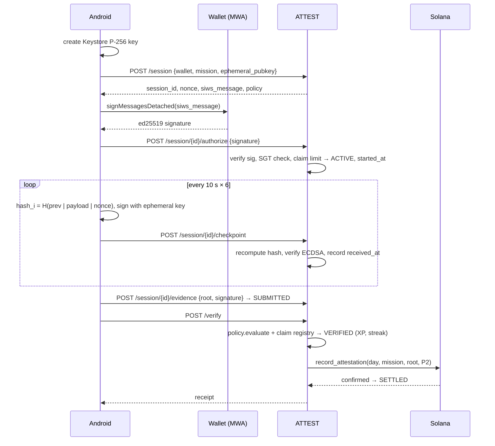

# Evidence model

## Session

| Field | Where | Notes |
|---|---|---|
| `session_id`, `nonce` | ATTEST | `uuid4`, 128-bit `secrets.token_hex`; nonce is `UNIQUE` in SQLite |
| `siws_message` | ATTEST | Exact bytes the wallet must sign; binds wallet, nonce, session, expiry, ephemeral-key fingerprint |
| `ephemeral_pubkey` | Android Keystore | EC P-256, per session, deleted after the session |
| `started_at`, checkpoint `received_at`, `submitted_at` | ATTEST clock | Used for all timing rules |
| checkpoint hashes, `chain_head` | both | Server recomputes; client value must match |
| `sgt_mint` | ATTEST | Device identity for claim limits (null in development mode) |
| `witness_root` | — | 32 zero bytes; witnesses are not implemented |
| `evidence_root` | both → chain | Only this commitment goes on-chain |

## Chain

```text
genesis      = SHA256("PRESENCE/genesis/v1" | session_id | nonce)
checkpoint_i = SHA256("PRESENCE/cp/v2" | prev_hash | payload_i | nonce)
payload_i    = "{index}|{timestamp_ms}|{elapsed_ms}|{foreground 0/1}|{interactions}|{response_ms}"
root         = SHA256("PRESENCE/root/v1" | last_checkpoint_hash | witness_root)
```

`|` is the byte `0x7C`; hashes are raw 32-byte digests. Implementations:
`backend/attest/evidence.py` and `app/.../evidence/EvidenceChain.kt`. Both are tested against the same
golden vectors (`test_evidence_chain_golden_vector`, `EvidenceChainTest`).

## Flow



## What a checkpoint contains

Only counts and booleans for a 10-second window: whether the session left the foreground, how many times the user
answered the presence check, and how long the check was on screen before the first answer (`response_ms`, -1 if unanswered). No coordinates, no raw touch streams, no sensors, no location.
These are **continuity and fraud signals**, not identity.
